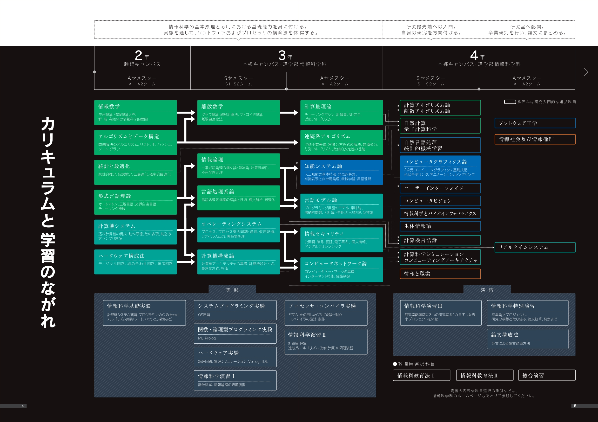

社会人歴2年と2ヶ月と書けばまだまだひよっこ感漂うけど3年めと書けばそろそろ駆け出し名乗るのには厳しいなぁと感じる今日このごろです。

1年を節目にいろいろ振り返ってみたいけど結局はインプットばかりの年だったので、2年めに読んで良かった本を書いてみる。

この一年のキーワードは「大規模開発」と「コンピュータサイエンスの基礎力」です。

2年めに入ってすぐに新規プロジェクトにアサインされてさまざまな課題に当たりました。例えばほぼ経験のないJavaのレビューをしなければならなくなり、技術的成長が求められていた点や、仕事の優先順位付け等のプロジェクトマネージメント的なことも学ぶ必要がありました。

一方で、やはり技術にちゃんとコミットして軸足を置きたいと思っていたので、明らかに足りていないコンピュータサイエンスの基礎固めにこの一年使いたいなと思っていました。応用情報技術者試験に受験したのもそういうモチベーションのためです。

だから本の種類別テーマは「大規模開発」「コンピュータサイエンス」「その他」で分けてみました。

## 大規模開発編

### 技術寄り
- Scott(2000)『[Writing Robust Java Code
The AmbySoft Inc. Coding Standards for Java](http://www.ambysoft.com/downloads/javaCodingStandards.pdf)』

まずはコーディング規約を探ることから始めました。もちろんプロジェクトにもコーディング規約はあるし、コードを読めば全体的なルールは伝わってくるが、一般論として知っておきたいなと思って探しました。また世の中には『[リーダブルコード](https://amzn.to/3wq5wiZ)』や『[コードコンプリート](https://amzn.to/3uri3S5)』など、コードのお作法的な良書はたくさん存在するけど一般的すぎる。プロジェクト独自のルールより抽象的でリーダブルコードより具体的な、言語毎の視点から考えるコードの書き方的な文献を探していました。この条件を満たすもので有名なところでいうと[Googleのスタイルガイド](https://google.github.io/styleguide/javaguide.html)や[Sun Microsystems本家(Oracle?)のスタイルガイド](https://www.oracle.com/java/technologies/javase/codeconventions-contents.html)が有名だけど、三者サラッと読んでみてScott(2000)が一番しっくり来たのでこちらを読み込むことにしました。

こちらのガイドでは単にルールに留まるのではなくどういう意図でそういうルールを設けるのかを書いてくれているので、逆にどの程度までルールからの逸脱が許されるのかのトレードオフを考えることができる。

これは自論だけどこのコーディング規約系はある種のコミュニケーションの問題だと思う。だからJavaの規約とはいえ多言語使いの人にも学べることが多いと思う。

またこれを読んだからといって自分でも惚れ惚れするようなリーダブルなコードが書けるようになったかと言われたらそうでもないです。僕のコードは、あまり省略を嫌うあまり変数名が長くなりがちだし、永遠に修行な点もコミュ力と同じですね。

コミュニケーションハンドブックとして一冊いかがでしょうか。

- ジョシュア・ブロック(2018)『[Effective Java 第 3 版](https://amzn.to/2zKCMcH)』

去年に引き続きランクイン。去年は理論的な関心からとてもためになっておすすめしたけど今年は実践的な見地から載せてみました。

この本が如何に実践向きに書かれているのかを改めて知ることができた一年だったなぁと思います。こちらもScott(2000)と同様、アンチパターンを見逃すとどのような問題が発生するか、どのような修正で問題が回避できるかが書かれていてとても応用の効く内容だと思います。特に大規模開発をするとなると、ビジネスや既存コードとの兼ね合いでアンチパターンを採用しなければならないような場面も多くあるのかなと思い、その場合どのような問題が発生しうるかを考えることは重要だと思います。

少なくとも以下の章をレビュー時の根拠として暗黙に引用しました。

1. 項目6 不必要なオブジェクトの生成を避ける
2. 項目28 配列よりもリストを選ぶ
3. 項目43 ラムダよりもメソッド参照を選ぶ
4. 項目59 ライブラリを知り、ライブラリを使う
5. 項目61 ボクシングされた基本データ型よりも基本データ型を選ぶ
6. 項目72 標準的な例外を使う

他にもJavaの基本的な考え方(アクセス修飾子やコンポジットパターンなど他の話題多数)に関する考え方も大きく影響を受けました。

- 結城浩(2004)『[Java 言語で学ぶリファクタリング入門](https://amzn.to/2z0FmLx)』

こちらも去年に引き続きランクイン。きれいなコードはどのようなコードかというのをずっと考えていて、結局は汚いコードではないコードを考えるのも見方の一つとしてはありだなというモチベーションで読み直しました。個別の事例ももちろん勉強になったけど、たくさんのリファクタリングの事例をリーディングすることでコードに対する肌感覚みたいなものが洗練されていくのを感じました。

特に要件が煩雑で素で書いたらifの4重ネストになるようなコードを、この本の「第2章 <<制御フラグの削除>>-制御フラグでコードが読みにくいなら」と持ち前の†競プロ力†によってネストを1つにまで減らし、リーダブルでテストの煩雑さを解消するコードを書くことができました。

- Robert C.Martin(2018)『[Clean Architecture 達人に学ぶソフトウェアの構造と設計](https://amzn.to/3wrw6rY)』

Robert C.Martin(2018)で初めてアーキテクチャー、特にオブジェクト指向で大事なSOLID(特に制御の逆転、(IoC)、依存性注入(DI))について意識するようになりました。このあたりの抽象化の技法こそWeb屋の真髄なのかなと思います。この本を通じてオニオンアーキテクチャーを学び、ビジネスルールを最重要視しその決定にプログラムを寄せることで得られるうれしさ、及びその方法を知ることができます。学者崩れで浮世離れなほどビジネスに関心をあまり払わずにいた僕にはいい薬でした。DDDの話題で言うと成瀬氏のYouTubeチャンネル及び書籍(『[ドメイン駆動設計入門 ボトムアップでわかる! ドメイン駆動設計の基本](https://amzn.to/3fxYWAe)』)もとても良かったです。

アーキテクチャーが主題の本ではあるけど、構造化・オブジェクト指向・関数型の違い等にも触れられていて割と話題は多岐にわたる。この御三家のあとの総括が心に残っているので引用しておきます。

>これら3つのパラダイム(構造化・オブジェクト指向・関数型プログラミング)は、我々から何かを奪っている。それぞれのコードの書き方に何らかの制限をかけている。いずれのパラダイムも我々にパワーや能力を与えてくれるものではない。過去半世紀にかけて我々が学んだのは、**何をすべきでないか**である。

例えば方法が1000あったとしたらそれは自由度などではなく、むしろ999個間違った選択肢が存在することになる。きっとコーディングルールを設ける意味もリーダブルなコードを書く意味もこういうことなんだろうなと思っています。

そういえば同時期に[ヤギの人の記事](https://qiita.com/arowM/items/e1af320e2755461649a0)が流れてきて同じようなことをおっしゃってたのが印象に残っています。以下引用します。

>CSSの書き方は一通りではありません。
>好きな書き方を自由に選ぶことができます。
>これは一見すると良いことですが、**裏を返すと最適ではない書き方がたくさんある**ということです。
>この場において最適な書き方がどれか、CSSを書く側に判断を委ねているのです。
>つまり、深い洞察力と思考力を持った者が、さらに重厚な知識を備えなければ、ひどいものを大量生産できてしまいます。

CSSのオレオレは...あまり想像したくないですね笑

- [糞コードは直すな。 - Qiita](https://qiita.com/kotauchisunsun/items/d03c1e6936ffb250e4a1)

ちょうどいい時期にこちらのQiitaの記事が回ってきていろいろ考えさせられたので書籍ではないですがランクインしました。基本Qiitaポエム厨Hate勢ですがやはり光るものがあるのも否めないのがQiitaポエム。

この記事が刺さった理由が一言でいうと、「勉強のために仕事してる。ビジネスとか知らん」という院生崩れの鼻をへし折ってくれたからです。

例えば以下の引用文など。
>しかし、実力のある新入プログラマーは「これは糞コードだ！」と思い、「ビジネスの知識が浅いまま」作ってしまいます。しかも、「根底が腐っている」と思って、完全にリライトしたくなります。そういったコードは実は読みやすく綺麗かもしれません。しかし、経歴が浅いためビジネスの内容を取らえ切れず、仕様のミスを含んでいる可能性が高いです。一方で、糞コードは、今まで幾多の事故(と多大なる犠牲)を経て、修正を重ねられているため、技術者にとって修正難易度は高く糞コードかもしれませんが、ビジネスを安定的に回すという面では実績がある。という辛い現実があります。

研究者へのコンプレックス(というより好きな勉強がライフワークとして許されるようにみえる高等遊民の生活への憧れ)から学びたいものしか学びたくない、汚いレガシーなコード、枯れた技術なんて触れたくないというある種の傲慢さを持っていましたが、この記事やRobert(2018)を読んであくまでビジネスドリブンなことを意識する必要性・重要性や雇われとしての自分の責務等もきちんと自覚するようになり、ある種の割り切りができるようになりました。ある意味一番成長に寄与した文章かもしれません(笑)

### プロジェクト・マネジメント寄り
大規模開発をやることになったという背景もありますがなにより「フロー効率」という概念に触れて以降ドハマリしました。

- 大野耐一(1978)『[トヨタ生産方式――脱規模の経営をめざして](https://amzn.to/3wqbJeN)』

まずはこの一冊。制約理論、フロー効率の核となるトヨタ式生産方式について語った古典。如何に無駄をなくすか、課題の本質は何かなどの問いに取り組み、これらを解決する手法を提案する。プロジェクト・プロダクトマネジメントの本で「トヨタ生産方式」に触れられていない本はほとんど皆無であり、読み物としても読みやすく面白いので一冊目にぜひ読んでみてください。この分野の本読み漁ってたら絶対読みたくなるので一冊目でいいかと。

- エリヤフ・ゴールドラット(2001)『[ザ・ゴール ― 企業の究極の目的とは何か](https://amzn.to/343YuV2)』
- エリヤフ・ゴールドラット(2014)『[ザ・ゴール コミック版](https://amzn.to/3fDoT1l)』

生産マネジメントの金字塔。もしあなたが工場を運用する立場になったらどのように運用するだろうか。ナイーブに資本・人材をフル動員して生産量増大を目指そうとはしないだろうか。その結果何が起こるかといえば大量の仕掛り在庫が発生し、製品は市場の需要が満たすことができず赤字操業に陥ってしまう。前半は資本をフル動員した結果赤字に陥ってしまうメカニズムを明瞭に記述する。明に記されているわけではないが、この作り過ぎのムダはきっとトヨタ生産方式からの着想なのではないかと思う。
後半は、資本・人材をフル動員するという局所局所で生産量を最大化するのではなく、ホリスティックに全体を眺め、ボトルネックとなっている工程を見極め解消していくことで生産量を高めるという筋書きである。

ここで局所最適、全体最適という考え方が強固になり、自分ががんばっていることが局所最適に寄りすぎているのではないか、プロジェクトとしてやるべき優先タスクがあるのではないかと考えて仕事をするようになりました。

ただ、本の方は冗長なので、本の方を一度読むよりも漫画版を繰り返し読むほうがおすすめです。僕はこの手の安易な漫画化にはあまりいい印象を持っていませんが、この漫画版には大事なエッセンスを逃すことなくコンパクトに纏まっているので胸を張っておすすめできます。

-  Niklas Modig and Par Ahlstrom(2012)『[This is Lean: Resolving the Efficiency Paradox](https://amzn.to/2T5mx3z)』

僕はこの本からプロジェクトマネジメントに入門しました。Niklas Modig and Par Ahlstrom(2012)ではプロローグで以下のように宣言します(訳は私がつけました)

> This Is Lean is a book about a new form of efficiency that e call "flow efficiency" ( This Is Lean は我々が"フロー効率"と呼ぶところの新しい効率性の形態に関する書籍である。)

僕の中でムダを無くすトヨタ生産方式、ボトルネック排除を目指すTheGoal、そしてフローという入り口から出口までを如何に早く駆け抜けるかを書いたThis Is Leanは一本の筋道がたち、段々と抽象化がなされているという感想です。

This Is Leanではリソース効率(局所最適) vs フロー効率(全体最適)という構図で工程を見るのですが、リソース効率重視だとどうしてフロー効率が下がってしまうのかという議論を展開し、本来あるべき姿を語る。

読み物としても大変面白く、特に挿絵が傑作でした。洋書でいえば『Flowers For Algernon』以来寝食を忘れて熱中して読破しました。

以上の3冊の考え方は巷のリーン・アジャイル。スクラム開発の核となる考えや態度なのでぜひこちらを先に読んであたっていくことをおすすめします。

余談ですが、最近邦訳版も出たそうです。

-  エリヤフ ゴールドラット(2003)『[クリティカルチェーン―なぜ、プロジェクトは予定どおりに進まないのか?](https://amzn.to/3wrtpa8』)』

フロー効率、TOC、全体最適的な考えがプログラミングの世界でも十分に応用できることは周知されたけど、肝心のプロジェクトマネジメントでの方法論まで落とし込まれた情報は少ないのかなと思います。
なにかサービスを作ろうと考えた時、プロジェクト(期日)ドリブンvsプロダクトドリブンという構図が考えられ、昨今のアジャイル・スクラム等の書籍は後者に寄りすぎているきらいがあり、大規模開発を請け負う僕みたいなケースではしばし当てはまらないなぁと感じていました。
その中でもプロジェクトドリブンなサービス開発をする上でこの本ではどのように気をつけてスケジュールを組んだらいいのかなどがいい感じの具体度で記述されています。カルチャーとして浸透させるのは大変ですが、きっと考え方の足場がためはできるのではないかと思います。

- メアリー・ポッペンディーク、トム・ポッペンディーク『[リーン開発の本質 ](https://amzn.to/3bMfDa6)』

- メアリー・ポッペンディーク、トム・ポッペンディーク『[リーンソフトウエア開発～アジャイル開発を実践する22の方法～ ](https://amzn.to/3yydkB2)』

- メアリー・ポッペンディーク、トム・ポッペンディーク『[リーンソフトウェア開発と組織改革](https://amzn.to/3oGboSs)』

ポッペンディーク夫妻のシリーズ。全体最適・アジャイル等の考え方はプログラミングの世界でも浸透し始めていますが、実はTheGoalやトヨタ生産方式はあくまで製造業の話であり、システム開発とは違う世界であるという事実はあまり意識されていないように感じます。その中で、製造業で生まれたリーンの考え方をシステム開発に置き換えるとどうなるのだろうという議論をし、知見を体系化しているのがこの夫妻の書籍群です。僕自身プロジェクトドリブンなシステム開発の世界に身をおいている一方、ある程度具体的なことをインプットしようとするとどうしてもアジャイルやスクラムなどのプロダクトドリブン的な考えの本しか見当たらないという苦があります。その中で具体的なプラクティスを語りつつ、プロジェクトドリブンvsプロダクトドリブンとは違ったフィールドで語られていてすごく実践的な知見を得ることができました。

3冊ともすごくおすすめですが、強いて挙げると『リーン開発の本質』から読んでみるといいと思います。

(余談ですがこんなに質の高い本が3冊とも絶版になっている日本の現状から日本のシステム開発の未来は暗いなと感じずにはいられません...)

- David Scott Bernstein(2019)『[レガシーコードからの脱却 ―ソフトウェアの寿命を延ばし価値を高める9つのプラクティス](https://amzn.to/3yw9GaR)』

こちらもプラクティス集。上までで紹介したのがいわばどのようにリソースを配分するかやどのようにリソースを活用するかの話がメインだったのに対し、こちらではきれいなコードを書くためにはどのようなルールを設けたらいいのか、汚いコードとは、きれいなコードとはといったプログラマー個人として知って置かなければならない原則について述べられた書籍です。一方リーダブルコード的な規約の話とも違って、どのように進めていけばバグの少ないきれいなコードになりうるかみたいなダイナミックなものが話題の中心です。小さく品質の高いモジュールを作ってそれを組み合わせていくプロセスで得られるうれしさが深く学べます。また、プラクティス集と書きつつもプラクティスの考え方の背景などの記述されているのですべてのプラクティスが活かせないような職場でもその思想を反映させるにはどうしたらいいだろうと考えるだけでもコードの品質は上がると思います。

- ケント ベック, シンシア アンドレス (2015)『[エクストリームプログラミング](https://amzn.to/3yvHDbG)』

やはり、リーンやアジャイルの考えかたの根幹、思想を知りたくて書籍を読む中で出会ったのが本書です。何度も書いている通り、僕の場合はリーンは学ばなければならないがアジャイル・スクラムとは方向性が違い、なおかつある程度の具体的なプラクティスが書かれたものを求めていた。そしてその要求を満たすのがなんと困難な道程であったか...。その要求を満たすのは結局ゴールドラットのクリティカルチェーンくらいしか見つかっていない現状です(結局US等ではフォーたーフォールなんてとうの昔に捨て去っていて知見の進化がないということなんでしょうかね...)。ただ、具体度の要求を外し、一段抽象度を上げてみると良書にたくさん出会えます。シャワーのように本を読んで思想・哲学を血肉にしていきましょう。

- Robert C.Martin (2020)『[Clean Agile 基本に立ち戻れ](https://amzn.to/3fbhwz8)』

「基本に立ち戻れ」いい言葉ですね。この本はアジャイルという言葉が氾濫し、独自解釈されてオレオレで運用されている現状を嘆き書かれた書籍です。やはり繰り返し読むことで思想・哲学が血肉になっていくのを感じます。
アジャイルとして学びがあるのはもちろんですが、アジャイルソフトウェア宣言が生まれたときの話など、おもしろい小話を散りばめられてて読み物としても面白いです。

- 榎本明仁他(2019)『[大規模スクラム Large-Scale Scrum(LeSS) アジャイルとスクラムを大規模に実装する方法](<https://amzn.to/3oEBB3T>)』

これだけプロジェクトドリブンだとか強調してきましたが、もちろんアジャイルやスクラムの基本も抑えています(笑)。スクラムを大規模開発に活かしたいというのは思い浮かびそうな発想だけど、それをフレームワーク化するムーブメントが散発化しているのは知らなかったので、興味から読んでみました。
普通にスクラム入門としても役に立ちました。 僕の場合、リモートワークをしているのでリモートでどう協調していくかなどの話が興味深かったです。
あと各章で書籍紹介がなされているのですがそれが大変参考になります。プログラミングに依らず、『学習する組織』みたいなやや一般書寄りのものも紹介されていて、学習フィールドの視野が広がります。

余談ですが、大規模にスクラムを適応するフレームワークは雨後のたけのこの如く発案されていますね。全然キャッチアップできてない...。

- アッシュ・マウリャ(2017)『[図解リーン・スタートアップ成長戦略](https://amzn.to/3yuClNI)』

最後に変わり種を一つ。制約理論の考えをスタートアップに活用することに焦点が当てられた本です。今までプロジェクトドリブン、プロダクトドリブンな環境での制約理論的な考え方にも馴染んできましたが、これはゴリゴリの事業目線の本なので視野が広がればいいなと思い読みました。事業目線の話はあまり知らなかったので一般論としても勉強になりました。海賊指標(AARRRでしたっけ)なんてダイレクトに制約理論的な環境であることも言われてみれば確かにと思いましたし、ボトルネックを探して改善するフローに関しても納得できました。
システム開発、プログラミングから離れてみるのも気分転換になりいい体験になりました。スタートアップの方法論の本はまだまだ未読のものが多く、余裕が生まれたら読んでみたいと思います。

## コンピュータサイエンス編
IT人材としての基礎を作るために若いうちに触れておきたいなと思ったけどまずなにをやったらいいんだろうというレベルからのスタートでした。コンピュータサイエンスとは何かという全容から知る必要がありました。幸運にもさまざまな機関からブックリストやカリキュラムが提供されており、いろいろ見比べて必要な科目と書籍をチョイスしました。特に以下のサイトは重宝しました。

- [書籍 \| 東京大学 大学院 情報理工学系研究科](https://www.i.u-tokyo.ac.jp/edu/course/cs/references.shtml)
- [TeachYourselfCS-JP](https://github.com/ralphplumley/TeachYourselfCS-JP/blob/main/%E6%97%A5%E6%9C%AC%E8%AA%9E.md)

特に東京大学のような指標になるような大学が積極的にカリキュラムを公開してくれているのはとてもありがたいです。ありがとう、東大。
以下[東京大学大学院情報理工学系研究科コンピュータ科学専攻](https://www.is.s.u-tokyo.ac.jp/pamph/)のホームページの「カリキュラムと学習の流れ」のページより抜粋しています。

将来社会人博士に興味あるし、「院試に受かる程度の実力」をKPIにしても良いのかなーと思う今日このごろです(目標があったほうがいろいろ登りやすいので)

- ジョン・L. ヘネシー, デイビッド・A. パターソン (2014)『[コンピュータの構成と設計 第5版 上](https://amzn.to/349qB5a)』
- ジョン・L. ヘネシー, デイビッド・A. パターソン (2014)『[コンピュータの構成と設計 第5版 下](https://amzn.to/3bPLDdg)』

いわゆるパタヘネ本。コンピュータ・アーキテクチャーに関して網羅的に書かれている。コンピュータ・アーキテクチャの本は読み比べしたことないですが特に不満点はなかったです。僕の場合、コンピュータ・アーキテクチャに関する本の一冊目として本書をチョイスしましたが、今思えばこの分野を俯瞰できるような薄めな本を先に読んでおいても良かったなと思います。例えばnand2tetrisなんかをやっておくだけでも見通しがかなり良くなるのでおすすめです。
(薄いことしか言えずにすいません...)

- 林 高勲 (2019)『[作って理解するOS x86系コンピュータを動かす理論と実装](https://amzn.to/3wjtJHQ)』

かなり分厚い。前半が理論の部・後半が実践(実際OSを作る)部に分かれていますが、僕は前半しかやっていません。基礎的な事柄も図表やみごとな比喩を用いて丁寧に説明されているので、他の理論的なOS本の理解を確認する補完的な役割も期待できます。例えば桁の概念を分銅のアナロジーで紹介しているところなど僕も思わず使用したくなりましたし、クロックを映画館の比喩との対応付なども印象に残っています。
一方Amazonでも書かれている通り、読者の知識レベルの想定がぶれているようにも感じるときがます。例えばアセンブラの話とか、コンピュータ・アーキテクチャとCPUの前提知識がないとただの暗記の羅列のように感じると思います。後半の部で参照するようにとりあえず記したのでしょうか。不満点のような書き方しましたが、トータルで僕はこの本が好きです。

- Martin Kleppmann (2019)『[データ指向アプリケーションデザイン ―信頼性、拡張性、保守性の高い分散システム設計の原理](https://amzn.to/3uh5Z5v)』

あまりに神すぎるので、別の機会に改めて書きたいです。

- 増永 良文 (2017)『[リレーショナルデータベース入門―データモデル・SQL・管理システム・NoSQL (Information & Computing)](https://amzn.to/3yvGfG0)』

一般的なSQLの本では種々の定義が口語的に語られていたりとしっくり来るものがなかった。なんかWebエンジニア界隈ってあまりにDB雑に扱われていませんか。当然分野にもよりますが、DBはあくまでおまけであり、SQLと他のいわゆる普通のプログラミング言語とは別であることがあまり意識されていないように思います。
本書はアカデミア寄りのリレーショナルデータベースの本。リレーショナルデータベースの種々の概念が、我々に馴染み深い定義の宣言、数学的記述の繰り返しで書かれており、定義をクリアに把握しやすいです。リレーショナルデータベースがどのような思想のもと構築されているかということも明瞭に記述されており、リレーショナルデータベースに関する確固たる地盤を築くことができました。
特にデータベースの設計理論の話は勉強になりました。一方最適化の話題だと、もう少しアルゴリズムの紹介に紙面を割いてほしかったなーと思ったり思わなかったり...。あとはトランザクションに関する直列化可能性に関する種々の概念もちょっと理解し難かったです。他の本で補完しようと思います。

- みやたひろし (2019)『[インフラ/ネットワークエンジニアのためのネットワーク技術&設計入門 第2版](https://amzn.to/3hMYdy0))』

ネットワーク系で言えば『[マスタリングTCP/IP―入門編―](https://amzn.to/3i5cDcK)』とかが有名だと思います。僕も好きです。しかし、みやたひろし(2019)はより実践的・具体的な内容なので、理論が補完されます。ケーブルの種類・ルーターの吸気、排気の関係を意識した積み方みたいな泥臭い話題から、セキュリティ・負荷分散・可用性を意識した設計の話など幅広く触れられていて大変勉強になります。読みやすくておすすめです。
ネットワークの本だとどうしても概論的になってしまう傾向にありますが(それが求められているので当然なんですが)、本書は実際の運用を意識していて、かつしっかりと書かれたネットワークの実践本なので貴重だなと感じました。きっとマスタリングTCP/IPの理解も深まるでしょう。
これ読んでてネットワークに興味出始めたのでネスペもいつか受けてみようかしら...。

- 中島 匠一 (2000)『[代数と数論の基礎 (共立講座 21世紀の数学)](https://amzn.to/2REkgfw)』

コンピュータ・サイエンスといえば代数っしょっというテンションで環論くらいまで読んだ。数学の分野は入門するのが一番難しいですね...。その概念に触れ続け、具体例に触れ続け、問題を解くことでやっと腑に落ちる、そのような感覚を得るまでは忍耐の時間というイメージを持っています(その"忍耐の時間"も楽しくもあり尊くもあるのですが...。)。その意味でいうと中島先生の書籍は本当の意味で"初学者"向けに書かれていて、導入で躓くことがないです。基本的に代数学の本は群論→環論→体論と抽象から具体へと進んでいく構成が取られていることが多いのかなと思いますが、中島先生の本は全く別で、最初に初等整数論の理論や具体例をシャワーのように浴びて、「環・体」の話題に触れ、群を最後に置く構成になっています。具体から抽象の流れを意識されているように感じられ、初学者にはとても取り組みやすい構成になっていると思います。例が豊富なのは理解の確認につながるので独学勢には大変助かりますね。具体から始まるので、途中で挫折しても、得たものを応用しやすいのも嬉しいですね。例えば競技プログラミング関係で素数のことを知るモチベーションで代数学に入門しても、そういった具体的な話題は書籍の後半に置かれるきらいがあるのかなと思う。本書なら10ページ目とかで公約数の話題に入ったりしているのですぐにキャッチアップできます。そういった意味では競技プログラミング対策にもうってつけな気がします。

- 平林 隆一 (2006)『[工学基礎 代数系とその応用 (新・工科系の数学)](https://amzn.to/3oHhm5M)』

新・工科系の数学シリーズめっちゃ好きです。適度に薄いのでかなり読み進めやすいです。また、代数学と暗号理論みたいな、工科系への応用に関して紙面が割かれているのもとても得難く助かります。頑張れば本書だけでも進められると思いますが、例や説明が簡素だと思うのでそこは注意かなと思います。副読本があったり、逆に副読本的に使うのがいい気がします。

## その他
最後に学びがあったが、実力的に僕が書評できるレベルでないものや、ちょっとリファレンス的に利用したもの、有名すぎて大勢が書評しているものなど、僕が敢えて書評するまでもない(できない)ものを載せておきます。もしかしたら来年度に読み直して詳しく書き直すかもしれません。そのほか一般書も書きたかったけどきりがないのでやめておきます...。

- Brian W. Fitzpatrick and Ben Collins-Sussman(2013)『[Team Geek ―Googleのギークたちはいかにしてチームを作るのか](https://amzn.to/3hJzbQ3)』

- 前川 守(1988)『[岩波講座 ソフトウェア科学〈〔環境〕6〉オペレーティングシステム](https://amzn.to/3u9wObT)』

- Noam Nisan and Shimon Schocken (2015)『[コンピュータシステムの理論と実装 ―モダンなコンピュータの作り方](https://amzn.to/3vhds6e)』

- 山田 明憲 (2018)『[Docker/Kubernetes 実践コンテナ開発入門](https://amzn.to/3oEKrPn)』

- 大槻 兼資(2020)『[問題解決力を鍛える!アルゴリズムとデータ構造 (KS情報科学専門書)](https://amzn.to/2Sg6dN6)』

- 初田 直也 他(2020)『[実践Rustプログラミング入門](https://amzn.to/3oSl38Z)』

- [The Rust Programming Language 日本語版 - The Rust Programming Language 日本語版](https://doc.rust-jp.rs/book-ja/)

- もみじあめ (2021)『[Linuxで動かしながら学ぶTCP/IPネットワーク入門](https://amzn.to/3bPOX8e)』

## 今年度の展望
まずはコンピュータサイエンスの基礎固めを継続したいです。nand2tetrisを通してエミュレーション・演習が如何に理解をクリアにしてくれるものかわかったのでそれを踏まえてインプットよりアウトプットの比重を高めていきたいと思います。特にマルチスレッドの話題やI/O周りの話題はプログラミング言語視点でしか見たことがないけど、OS視点の理解がないと中途半端になってしまうと思うのでこれを期にOSに力を入れて勉強し直したいと思います。 前川 守(1988)を読みつつ、[Operating-Systems-Three-Easy-Pieces](https://github.com/syarochan/Operating-Systems-Three-Easy-Pieces-in-japanese)を読み進めていこうと思います。後者は優しい語り口でスレッドの話題が語られており、前川 守(1988)の理解を補完するに最適なように感じます。あとは本棚の肥やしになってるみかん本もやれたらいいなと思います。

また、業プロがバックエンド気味なこと、興味関心がバックエンド・インフラなこと、Martin Kleppmann (2019)に多大な影響を受けたことなどによりデータベース(正確にはデータの扱い方、分散処理全般)に関心を持つようになりました。理論・実践、SQLの書き方からモデリングまで多方向に関して極められるように頑張ろうと思います。

言語でいうと引き続きRustとJavaScriptを頑張りたいと思います。早くRustがファーストチョイスになるくらいなじませたいと思います。JavaScriptは雰囲気で書けてしまうがゆえにいつかなにかを踏み抜きそうで怖いなと思ってます(笑)。現状、標準語ネイティブがエセ関西弁使うくらいのノリでJavaScript書いているので一度きちんと勉強し直したいと思います。特にサーバーサイドJavaScript(Node.js、Deno)に興味があるので取り組めたらなーと思います。ただ、優先度高いのは他のサーバーサイド言語なので取り組むのはまだまだ先になりそう。
