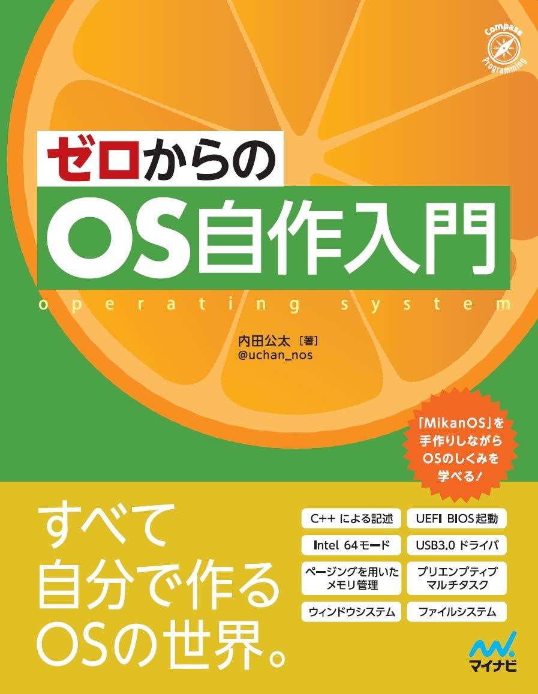
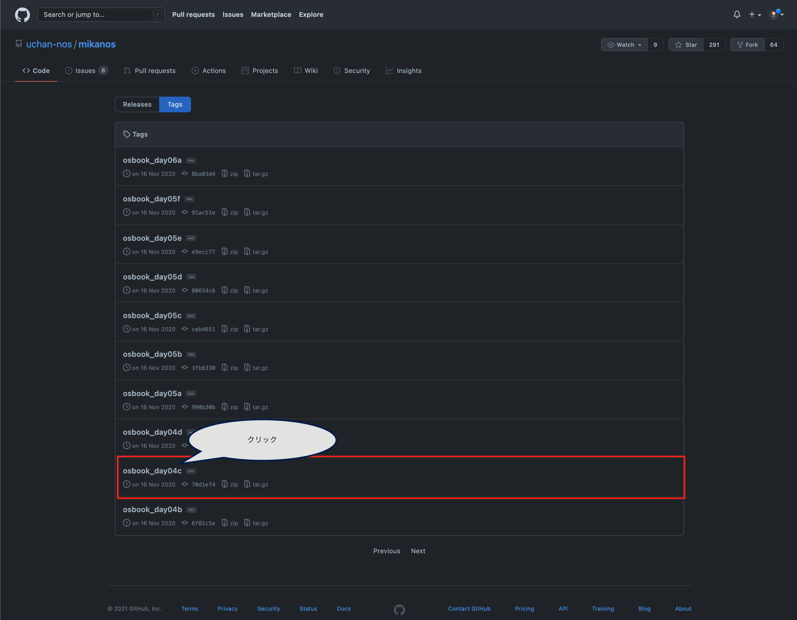
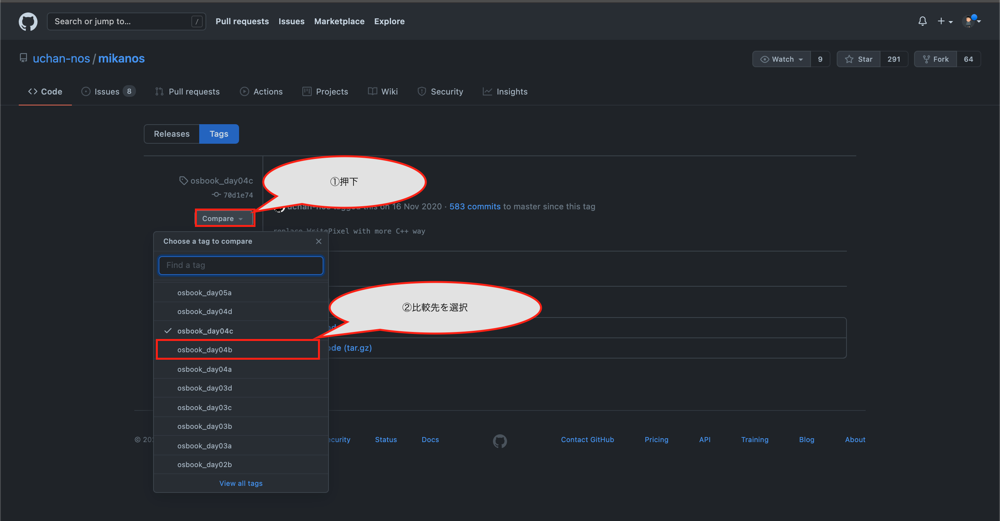
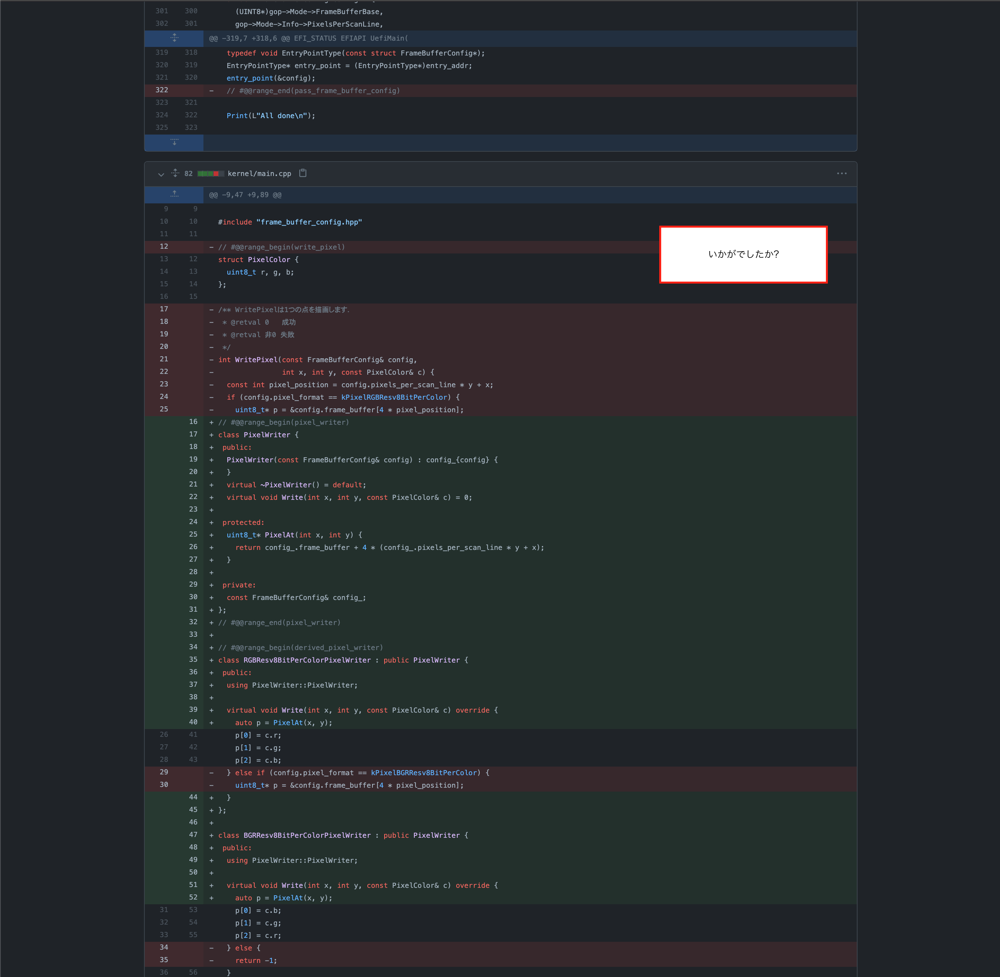
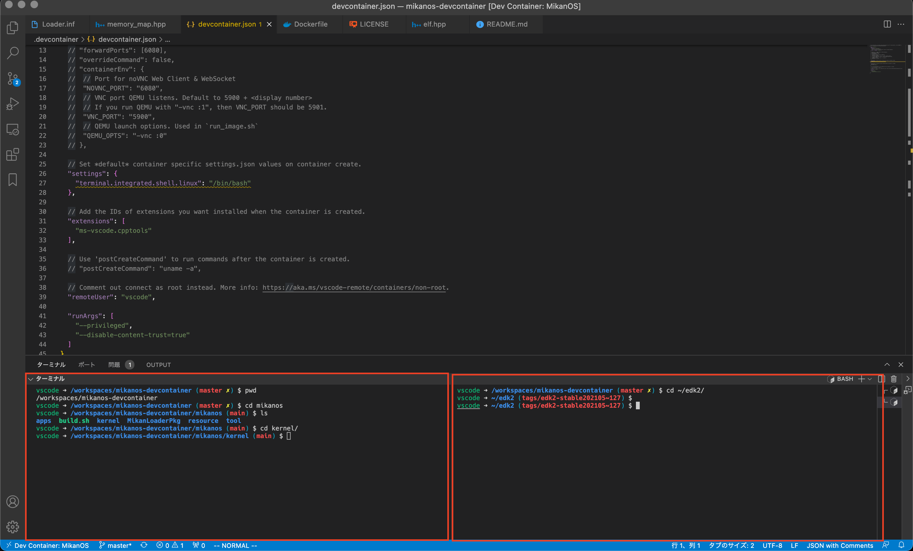

---
title: '『ゼロからのOS自作入門』(みかん本)を完走した感想とお気持ち表明'
date: '2021-08-29'
description: '『ゼロからのOS自作入門』(みかん本)を完走した感想とお気持ち表明'
tags: ['OS']
---

いわゆる[みかん本](https://amzn.to/38p72YG)。

エンジニアたるものOSの自作してみたいではないですか。僕は作ってみたかったです。あと自分の人生の目標として社会人3年でCS学部生レベルの知識を得た状態でいるというものがあり、OS自作は避けて通れないなという気持ちは持っていました。

そんな折、今年頭頃にこの本が話題になっていたので一念発起しますかということで始めました。30章あるのですが、一日まるまる使って2〜3章終わらせるペースで8月まるまるくらいかかりました。お盆も帰省せずにずっとこれやってました(コロチャン怖いですからね...)

いろいろ感想を書いていこうと思うんですが先にお気持ちをまとめておきます。まず本書のクオリティには文句のつけようがない(というより僕レベルだと内容の批判なんてとても恐れ多くてできません><)という点と、一方で僕の求めていたものが得られなかったという点です。割と辛口気味な書きぶりになると思いますが、作者のうーちゃんさんにはファンが多く、大体のレビューにて本書をある種盲目的に絶賛しているように見えるので、まあ辛口レビュアーがいてもよいだろうと作者の評判に甘えようと思うのである。

まず前提として僕がなにをこの本に求めていたのかを書きます

* 実践で培うOSの知識
* 座学で学んだOSの難所の明確化

あたりです。つまり、職業エンジニアがが、自分の仕事道具を知ることで仕事の効率性やクオリティをあげようということを期待していました。また、OSでは理論をなぞるだけでも腹落ちしにくいような概念があるように感じます。例えば並行・並列やページングなどのメモリ管理などがそうです。ページングで言えばテーブルで管理していることは知っているけど、実際どのような文脈(コード)でどのように管理されているのかは座学だけでは腹落ちしにくく、問題演習や実装をしなきゃ納得できないだろうなと思っていました。

一方この本の第一章で以下のように語られています。
> 本書のコンセプトは、筆者がOSを作る過程を細かく刻んで紹介するというものです。OSに関する理論を体系的に説明することを目指していません。**理論的な教科書の章末にある練習問題だけを抽出したような本だとも言えます。**(P40より、太字はAcasuneによるもの)

僕もこの本を通じて得たかったことも上の太字と符合するものであると思っていたのですが、自作過程で並列の話やそれを実現するあれこれは出てこず(並行の話はあり、数章割かれていました)、主記憶管理のページングとセグメンテーションの比較や歴史的な話はでてこないで天下り的に筆者から与えられたページング機構を黙々と写経していくといったものでした。

作るうちに気づいたことですが、つまり、僕はOSを通じて体系的OSを知るというよりは、細部の課題に関する理解をクリアにしたい、OS実装はそのための手段であり、いってしまえば何か(OS)を作ることを目的としている本書と作ることで理解を深めたいという僕の思いにずれがあったなと思います。

また、この本では写経をすることを推し、それを通じて学ぶことが基本思想になっていることは疑いようがありません。筆者の写経に対する思いは随所に記述されています。

ただ、OSのコード写経から学ぶという行為はある程度の前提知識が必要なのでは、あるいは前提知識がないと効率的ではないのではと思いました。例えば本書はC++で記述されていますが、C++独自の文法・仕様が説明なしや簡単な説明のみで使用されていて、実際どういった手続きで処理されているのか、なにを狙ったコードなのかを読み解くのがとても難しかったです。特にC++で低レイヤーを直接触るコードや、アセンブリ言語などは途中で理解を放棄しました。他にもEDKやUEFI、iPXE、QEMUなどの各種ツールがどういうもので、どういう背景感で生まれたものなのかがわからず、ただ準備されたものを使ったらなにか出力されたといった腑に落ちなさを随所で感じていました。

誤解してほしくないのはこれらは本書への批判ではないということです。紙面の都合もあるでしょうし、結局は僕が求めていたものと筆者が狙っていたものが違っていたんだろうというだけなので。

思うに筆者は想定読者のペルソナとして、高校生時の自分をおいていたのかなと思います。筆者はこの本の前作とも言える『[30日でできる!OS自作入門](https://amzn.to/3sZUctp)』を通じて高校生時にOSを自作した経験が素になっている旨が随所で語られ、写経による勉強も当時の経験を素にしているそうです。確かに、比較的に時間がたくさんある学生で、恵まれた仲間ないしメンターが得られる状態であれば上記の概念で詰まることもなさそうですし、自分で興味を広げられると思います。また、きっと本書の使い方もそういうものだろうと思います。学生時代、ましてや高校生でこれを写経なりでも実装したらきっと将来の進路に決定的な影響を与えるだろうというポテンシャルを感じます。つまり、理解より実践、理解は本書のあとに頑張ってくれというものです。そしてそのような時間の使い方ができるのは実質学生か専門家だけではと思うのです。

その意味で社会人かつ専門家でもない僕の欲求とは微妙にずれているのだと感じたのだと思います。

だからこそ、このまま写経して終わりだけではもったいない気がするし、せっかく参考文献を上げてくれているので、上記のような種々の概念の腹落ちを目指したり、C++の普段触ってこなかったような機能についても勉強してこそ本書を正しく評価できるようになるかなと思います。

本書の「はじめに」で作者は以下のように語っています
>(中略)しかし、OS自作は私たちに貴重な経験を与えてくれます。コンピュータシステムがどう動くかを探求することは知的好奇心を大いに刺激します。実用面でも、パソコンのハードウェアやOSの処理内容に関する知識はソフトウェアエンジニアの仕事の幅を広げてくれます。OSの動作に目が向くようになり、効率的に動作するアプリの作り方を探求できるようになるでしょう。あるいはシステムの障害原因調査において、OSをデバッグした経験をもとに深いところまで原因追求ができるでしょう。いざLinuxカーネルのコードを読む必要性に迫られても、OSを作った経験が有ると無いとでは読みやすさが格段に違います。

確かに、みかん本をやりながら岩波OS本やパタヘネ本の読み直しをしていると以前クリアにならなかった部分がクリアになり、壁が超えられた実感を感じました。みかん本以外にもいろいろやっているので必ずしもみかん本だけの力とは思いませんが、一方肌感覚としてみかん本のおかげで疑いようのないものがあったのも事実です(例えばメモリ管理の話などは特に)。また、実装してまだ短期間しか立っていないので期待していた上記のような効用をまだ得ていないだけかもれません。この読書体験でみられたような効用を実業務でもえられることを祈りつつ、書評を閉じようと思います。

## おまけ
感謝の意をこめて、あるいはコミュニティに対する敬意を込めて、あるいは本記事を読んでくれた読者に対する感謝の意味で僕の本書の進め方を紹介します。

僕の環境はMac OSです。OSのバージョンとかは知りません(メジャーバージョンはBig Surです)

* Macでの進め方

Macでの環境構築は鬼畜を極めているので心してかかりましょう。本書は基本的にUbuntuで作られていることを前提にして、Windowsでも、仮想環境を用いた環境構築方法の手順が書かれています。MacもUnix系だろ!!Ubuntuと同じ要領でいけるだろ!!と考えがちですがどうも無理みたいです。

ただ、Vagrantで仮想環境たてるなどいろいろな手段があり、一長一短で悩ましい。Vagrantだともっさりしてたり再起動がめんどうなどいらぬ心配があるなどがあります。

僕のおすすめは以下のページのVSCode devcontainerを使う方法です。僕自身VSCodeでこんなことができるとか知らなかったですし、再販可能な形でDockerを作られている人がいることに敬意を感じざるを得ませんでした。環境構築こそ本書で学んだ＆インスパイアを受けたランキング上位であるのはここだけの秘密です笑

[Docker ではじめる "ゼロからのOS自作入門"](https://zenn.dev/sarisia/articles/6b57ea835344b6#vscode-devcontainer-(%E6%8E%A8%E5%A5%A8))

2021/08/29時点だとMacでは上記の方法で理論上Macでも乾燥できることを僕が保証します。わからないことがあったらツイッターのDM等いただければ気が向けばお手伝いしようと思いますのでいってください。

* 進め方例

この本の素晴らしい点はタグ付けがかなり丁寧である点です。なので前節との差分を見ることで行単位でもブロック単位でも有るべきコードが確認できます。これを踏まえて僕が中盤から採用した戦略を紹介します。

まず、リモートリポジトリのTagsへアクセスします。([Tags · uchan-nos/mikanos · GitHub](https://github.com/uchan-nos/mikanos/tags?after=old-master))。仮に第4章のcの機能を新たに実装しようとするとします。この場合はまずそのコードに該当する「osbook_day04c」にアクセスします。

すると「Compare」ボタンによって当該タグがついた断面コードと他のタグがついた他の断面コードを比較できるようになります。

これだけなんですが、僕は知らなかったので共有してみます。ワザップの記事並みに内容が薄くて申し訳ない...

* ターミナルを二枚開く

Kernel全般をコンパイルするためにそのディレクトリをカレントディレクトリとして扱いたい場合と、他のディレクトリをカレントディレクトリとしてイメージファイルをビルドしたい場合があり、それを往復してOSを逐次的に作っていくんですが、ターミナルを2つ開いたら効率的だよっという小技です。

あと、最初はディレクトリ構成なれないと思いますが、とりあえず左のKernelのディレクトリと右のedk2のディレクトリは大事なんだーって覚えておくこと、位置も覚えておくと作業が捗ると思います。

## 参考リンク
* Acasuneの作業レポジトリ([GitHub - Acasune/MikanOS-practice: Transcribing MikanOS code](https://github.com/Acasune/MikanOS-practice))
* MikanOSの公式レポジトリ([GitHub - uchan-nos/mikanos: Educational Operating System](https://github.com/uchan-nos/mikanos))
* Macの環境構築①([Docker ではじめる "ゼロからのOS自作入門"](https://zenn.dev/sarisia/articles/6b57ea835344b6))
* Macの環境構築②([「ゼロからのOS自作入門」の副読本的記事](https://zenn.dev/karaage0703/articles/1bdb8930182c6c))
