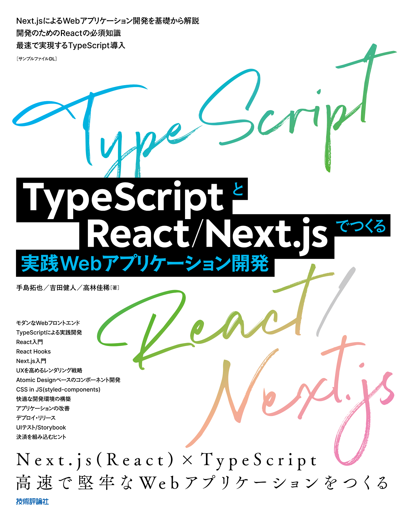
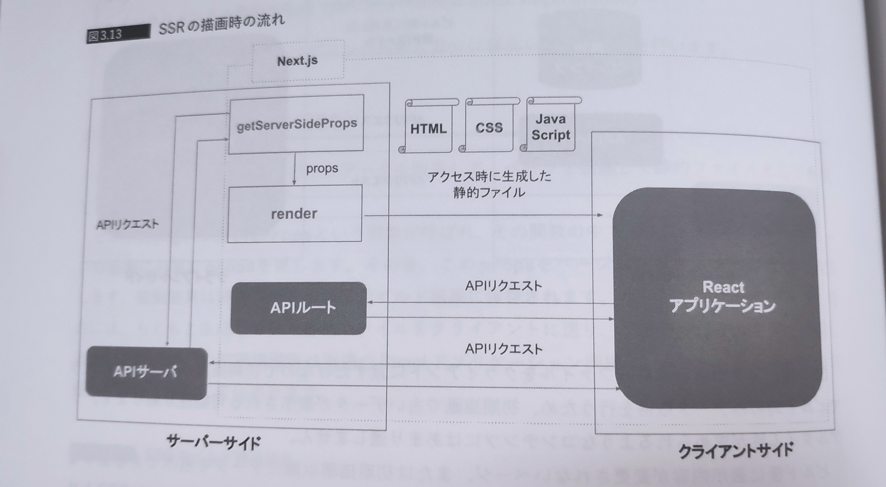

---
title: '『TypeScriptとReact/Next.jsでつくる実践Webアプリケーション開発』を完走した感想 '
date: '2022-08-19'
description: '『TypeScriptとReact/Next.jsでつくる実践Webアプリケーション開発』を完走した感想 '
tags: ['React','Next.js','TypeScript','書評']
---
## 書影

## 実演の様子

## 読もうと思ったきっかけ
作者のひとりが以前執筆に関わっていた『[Vue.js入門 基礎から実践アプリケーション開発まで](https://amzn.to/3ChhjX3)』という書籍が最高だったので、あの厳密さで書かれたReact, Next.jsの解説書がほしいとずっと思っていたから。

## 感想
正直微妙だった。下で割と酷評するが、そもそも希少な著者らのリソースをもとに作成された本書を3,500円であることを勘案するに、コストに見合うものは手に入れられると思う。個人的には「強くは勧めないけど、友人が購入すると言ったら下を説明した上で止めはしない」くらい(点数で言えば3/5くらい)です。

本書をこなすことによって、なんとなくReact、TypeScript書けるエンジニアが、なんとなくNext.jsを使ったアプリがなんとなく作れるようになるレベルまでいけると思う。ただ、各技術に対するなんとなく感は本書のみだと消えることはないだろう。

個人的にはこのなんとなく感を払拭するために、React, Next.jsの仕様や深い使い方にフォーカスした本を引き続き探していこうと思ってますが、このようなニーズに応えた書籍はないものでしょうかね...(その点TypeScriptは割と恵まれている印象)

### 良かった点
##### 1. 第１章の概説がわかりやすかった。  
jQuery, AltJS, React, Nextが求められた背景、それを可能にした技術・発想を改めて学ぶことができた。  

##### 2. 割と規模の大きいアプリケーションをデプロイまで導いてくれる  
ハンズオンパートでvercelにまで踏み込まれている点がよかった。実際ローカルビルドだけで終わらせてもよさそうなのにherokuやvercelを使ったデプロイまで伴走してくれる点からも「実用」を意識して作成されていると感じた。  

##### 3. 開発方法が本格的  
ユニットテストは言わずもがな盛り込まれているし、AtomicDesignをベースにStoryBookを逐一用いてコンポーネントを確認する構成になっており、独学では学びづらいファイル構成、開発手順の手本が示されていて学びが大きかった。また、CSS in JS や、ログ設定、SEO対策、WAI-ARIAなど触れられる周辺トピックの広さも助かった。このような周辺トピックも体系的にまとめられている点もネット記事では得にくい(ないとは言わない)書籍の良さなのかなとも思う。

##### 4. メンバーが全員海外スタートアップ経験者  
こちらがどこまで寄与するかはわからないが、上記の経験を持つ著者を得られている点のみで非常に価値があるだろう。日本のフロントエンド界隈は(悪い意味でも)参入障壁が低く、生のhtml, cssに関する情報は情報商材屋の食い扶持と化し、フロントエンドのカオスさから、誤解釈をもとにしたさまざまなオレオレ標準が跋扈していて何が正しいのかを峻別するのが大変難しい(だからこそ硬派な構成を本書に期待したのだが)。  
また、日本あるあるだと思うけど、フロントエンドのような標準が定まりにくい界隈でなぜかガラパゴスに進化していった日本独自の標準が定着する傾向にあるように感じる。だからこそ世界標準の手法を身につける価値は大きいように思う。その意味で、海外の、スタートアップでの業務経験のある著者を持てるという点それ自体がこの本の価値に寄与する部分は大きいと個人的に感じる。

### 悪かった点
##### 1. 誤字が異様に多い  
正直文意を読み取ることに支障をきたさなければあってもいいんだけど、ここまで誤字が多いと本文の品質をどうしても疑ってしまう。著者が3人もいるのに相互レビューとかせずに、担当分だけ割り振って合本にしたんだろうなと感じた。また、編集さんも特に深いレビューもしてないんだろうなと思わざるを得なかった。であれば商業書籍にする意味みたいなのが薄れるので残念だった。  

Amazonレビューなどの前評判的にタイポが多いことは承知していたので上記だけなら良かったんだけど、ハンズオン形式なのに普通にファイルのパスやソースコードが間違ってたりするので、小さいとはいえ作業の手戻りが発生するレベルのものがあった。(というか少なくない誤植・タイポがGitHubで確認しないと修正不可なのだがそれは書籍として許されるのだろうか) 。  

##### 2. 内容がスッと入ってこない  
図の作成に関してだけど、僕のもつメンタルモデル的に左にクライアントサイド、右にサーバーサイドを配置するような事前想定で読むものだと思うけど、こちらの図では逆だったので読むときに混乱があった。また、エクセルのオブジェクトではなく、例えば公式アイコンみたいなものを使えばそのような誤解を軽減することができたのではと思う。そういう一手間みたいなところが全体的に省かれていて本を作る熱意みたいなものがあんまりないんだろうなと感じた。(5章で行われるCSRの説明ではクライアントを左に、アイコンも使っている。悪く言えば書籍全体を通した統一感がない。)  

こちらの図も同様である。どうして1Pで収めるのではなく、このような体裁にしたのだろうか。  

##### 3. ソースコードが動かない  
ハンズオン形式の書籍なのに、(コードの誤字が原因で)写経しても動かないコードがあるのは正直どうなのと思う。エラーをもとに直したが、流石に読者のレベルに依存し過ぎていると思う。というか出版前に書籍コードをテストしたりしてないんだろうか。  

あとどうしても許せなかったのは、あるコンポーネントがStoryBookで表示バグとなる問題に遭遇したのだが、それはそのコンポーネントとは全く関係のないグローバルなコンポーネントに対する加筆が必要だったからというもの。さすがにこのあたりの解説がないのは不誠実極まりないと思った。  

その他も書籍のサンプルコードがしれっとレポジトリでは修正されてたりするので、書籍から当該コードをレポジトリからみつけて、それを写経するほうが、本書を写経するよりがいいと思う。  

##### 4. ハンズオン形式なのに全コード解説しているわけではない 
こちらは僕の好みが大きいと思うけど、こういう写経メインのハンズオン形式は全部自分で書くことの達成感みたいなものも醍醐味の一つだと思う。なのに、残りはGitHubのレポジトリを参照してねで飛ばされるので達成感的にもにょってしまう。読者の裁量だから勝手に写経しろよという話ではあるんだけど、読者目線では写経できる規模のアプリケーションに留めてほしかったなと感じる。  

##### 5. 説明が簡素  
前提として個人的には2-4章(TypeScript,React,Next.js)を深く広く語る書籍を期待していた。だが、こちらは5,6,7章へと続くハンズオン形式のアプリ制作に必要な技術を最低限+αくらいを伝授する内容になっている。また、「そういうものがあるんだーへー」くらいで終わっちゃう内容でありその後の応用や深い理解は、公式ドキュメントや各フレームワーク実装の読み込みを前提とした、今後の読者の努力によるものが大きいだろう。使い方だけではなく、もう少し踏み込んで内部構造を開いて欲しかった。  

これはハンズオンパート(5,6,7章)でも同様で、今まで使ってこなかった概念がいきなりコードに現れたりするので、個人的には気持ち悪かった。本書全体を通して言えることだけど、ハンズオンを完成させた後に気になる点を自分で再度調べてこそ本書の価値を吸い取ることができるのだろう。個人的には書籍は書籍で完結してほしいのだが...  

## まとめ
複数著者で一冊の本を作ることの良さ悪さがあると思うけど、本書では良さが全く活かせず、悪さばかり目立つ結果になっている点が非常に残念だった。そして、誤字の量や構成の悪さを見るに、編集者がきちんとグリップできていないんだろうなと感じた。僕は大体書店でパラ読みして信頼性や自分のニーズに合っているか基本チェックするようにしているが、『[Vue.js入門 基礎から実践アプリケーション開発まで](https://amzn.to/3ChhjX3)』の読書体験から、本書に限っては著者・編集者・出版社への信頼、応援の気持ちを込めて発売日直後に購入したが、二度とそういうことはしないだろう。 
