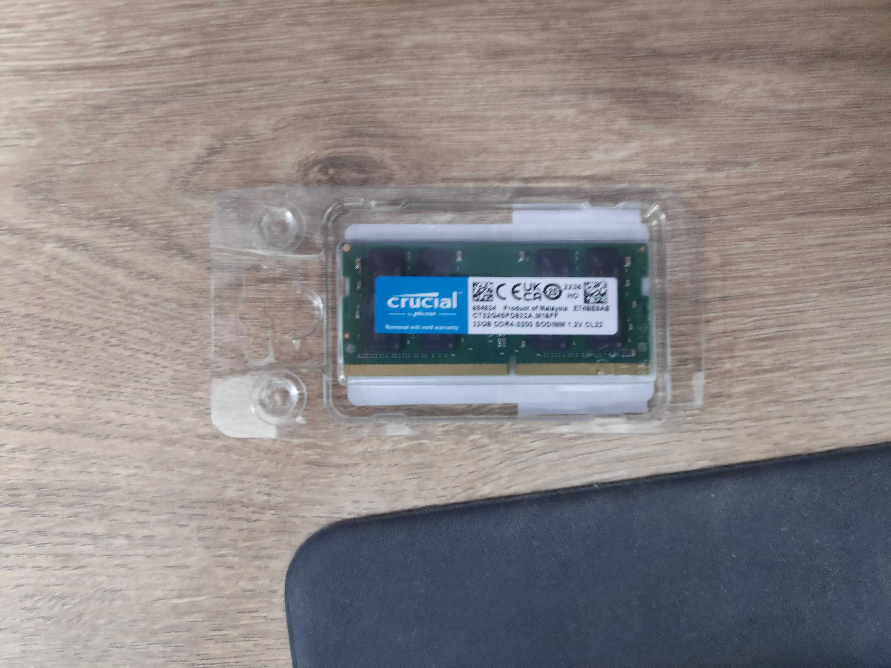

## はじめに
新卒入社時の初任給で購入したMacBook（8GB）の性能劣化が著しく、プログラミングもままならなかったので新規PC購入が急務だったが、買うとしたら高スペックのPCを買いたいと思い、お金の持ち合わせの問題でなかなか踏み出せないでいた。

例えば[M2Proメモリ16GB SSDストレージ512のMacBookPro(16インチ)](https://www.apple.com/jp/shop/buy-mac/macbook-pro/16%E3%82%A4%E3%83%B3%E3%83%81-%E3%82%B9%E3%83%9A%E3%83%BC%E3%82%B9%E3%82%B0%E3%83%AC%E3%82%A4-12%E3%82%B3%E3%82%A2cpu%E3%81%A819%E3%82%B3%E3%82%A2gpu%E6%90%AD%E8%BC%89apple-m2-pro-512gb
)は348,800円するらしい。（2022/02/04現在）

正直ラップトップであることに対する拘りもなかったので自作も視野に入れながらBIOでのデスクトップPCを探してみた。ただ、例えばmouseコンピュータで発売されている [mouse DT8-G-3050 \[ Windows 11 \]](https://www.mouse-jp.co.jp/store/g/gmouse-dt8-g-3050/)なんかは
AMD Ryzen™ 7 5700X、メモリ 8G×2 M.2 SSD 512程度で189,800円程度する。予算的にもオーバーしているし、メモリは32G以上のものを希望していたので一旦見送る方向で考えていた。

## ハードについて
上記のことを考えているうちに「ベアボーンでいいのではないか」とふと思うようになっていた。開発機がほしかっただけなのでCPUとメモリさえ上等であればGPUはおろかOSすら必要なかったからだ。結果的に上記要件を満たすPCを80,000円程度で組むことができた。

ベアボーンの詳細は例えば[ベアボーンキット - Wikipedia](https://ja.wikipedia.org/wiki/%E3%83%99%E3%82%A2%E3%83%9C%E3%83%BC%E3%83%B3%E3%82%AD%E3%83%83%E3%83%88)などに譲るが、ケース・マザボ（ビデオカード含）・電源CPUのみを提供しているキットだと認識してもらえると問題ないだろう。

僕が購入したのは[PN51-S1-B-B7186MD](https://amzn.to/40wY59Q)と [Crucial ノートPC用増設メモリ 32GB(32GBx1枚)](https://amzn.to/3HBsTgZ)だけだ。SSDに関しては以前自作したPCのものを流用した。

こうしてメモリ32GでRyzen7が乗ったPCを80,000円以下で揃えることができた。

中身を取り出してみた。分解時のネジが固く苦労した。精密ドライバーとペンチは必須だった。

メモリ。最初はコルセア製のメモリを買ったがなんと規格で違うくて全然はいらなかった！！！！開封済みだったので返品もせずに道具箱で次の目覚めを待つことに。やっぱりちゃんと規格は調べる、Amazonのサジェストを信用するあたりはやったほうがいいですね...。

組立後。ただSSDとメモリをソケットにさすだけの簡単なお仕事。本格的な自作PCでは電源の供給配線の接続がしんどかったなと思い出しながらその簡単さに感動しました。

## OSについて

次にOSである。僕はもともとMacユーザーであったし、WindowsOSのインターフェースや操作性が好きになれなかったので、消去法的にLinuxOSを選択することにした。[Distrowatch.com](https://distrowatch.com/) などを参考に、MX Linux、EndeavourOS、Mint、Manjaro、Ubuntu、Debianあたりを候補に上げた。ArchLinux等にも興味はあったが、開発時に非本質的な部分で詰まるのはいやだなという思いからDebian系に絞り、せっかく自分用PCだからメジャーどころは避けていろいろ遊びたいなという思いから今回はMX Linuxを選択することにした。

OSをインストールする様子。

マザボの設定で「Secure Boot」がOnになっていて当初はSSDにOSを焼くことができなかったが、こちらをOFFにすることによって無事インストールすることができた。

OSインストール中...。

インストール完了画面。

## 使用感について

使用感はめっちゃいいです！！アプリの立ち上げがとても早い！これがメモリCPUに由来するものなのか、OSに由来するものなのかはわからないですが、諸々の動作が遅い・性能が悪いというのは旧MacBookで感じていた不満点だったので解消されて嬉しいです。

特にDockerの話ですが、Dockerコンテナ内に作ったRust環境下でのactixのホットリロードに30分（！！！！）程度かかっていたのが、いまでは3秒程度で同様の作業ができます。

MacのDocker遅い話は例えば以下。  
[Docker for Mac が遅い(怒)](https://www.y-hakopro.com/entry/2021/07/11/175236)  
この記事で言えばホストとコンテナの同期に時間がかかっているとのこと。設定である程度改善するらしいが、Docker for Macはその他もいろいろ聞くのであまり良い印象をもっていない...。

OSの方も情報がないことは事前に予想をしていて、その点が不安でしたが、いまのところは特に困ってないです。基本的にUbuntuの情報をそのまま流用して解決できます。

強いて言えば、Linuxではデファクトスタンダードとなっているかな漢字変換ソフト「Mozc」において、英字モードでの文字入力でも入力中モードに状態が遷移してしまう、そしてそれが直せないという不具合がありましたが、ある日突然直ってました。このような小さな不具合はいくつかあったかなぁと思います。

その他でいえば僕はオレオレキーバインドを採用していましたが、MXLinuxでは簡易にキーバインドを変更するアプリをみつけることができず、また一方で他人にキーボードを預けたときに混乱が生じてしまっていた過去の経験からオレオレキーバインドからの卒業を決意しました。(ただ、CapsLockくんの解雇は簡単にできたのでこれだけはやりました)

あとはPCのスペックとは関係ないですがまっさらなPCということで、いろいろ設定に拘りたくなっちゃいました。特に、いつかDotfilesを作ろうと思い続けていたのですがさすがに手を出してみました。他の人の見様見真似ですがファーストコミットこそ大事だと思ったので恥ずかしげもなく公開してみました。

https://github.com/Acasune/dotfiles

シェルに拘るのは楽しい！ターミナルの画面などの生産性などに関係ない部分にさえ・だからこそ拘るというのはエンジニアとして享受すべき喜びなのではないかと思うのです。僕の人生の信条としても「ある分野でキモがられるほど知識・技能がある」「手段のために目的をでっち上げる」というものがあり、このような矜持を仕事に没頭する中で忘れていたなぁと思い返していました。

Dotfilesは日々の困り、モヤモヤをもとに日々アップデートしていくものだと思うのでこれからも拘ることをおろそかにすることなく育てていきたいと思います。

長くなってしまいましたがいいたいことはベアボーンはいいぞ！ということです。またネットゲームとか動画編集とかがしたくなったら、その時にもりもりGPU＆Win機汎用を作ろうと思います。いまのところ全く必要性を感じていませんが...。笑
